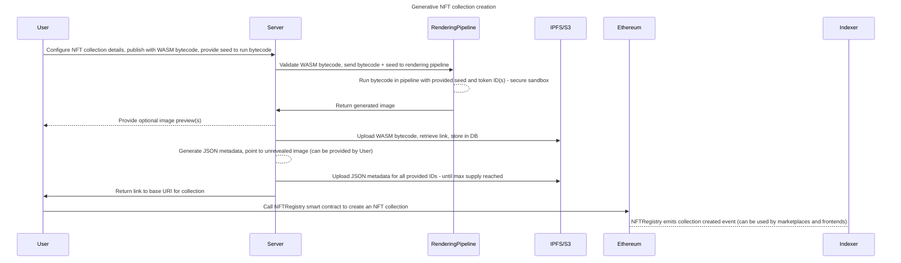

# Generative ART NFT Collection platform

This repository demonstrates the high level architecture of a hypothetical Generative art based NFT collection creation platform.

The repository contains the following smart contracts:

- [NFTRegistry](./src/NFTRegistry.sol): The primary contract users interact with to create their generative NFT collection
    - This is simply a manager contract which makes it extremely cheap for users to create their collections
    - The collections utilize the beacon proxy pattern; hence all collections are upgradable (via single transaction) in case the platform desires to introduce new features across all collections
- [NFTCollection](./src/NFTCollection.sol): The NFT collection which the user's would own (once they create it)
    - UUPS upgradable ERC721A smart contract with ERC2981 (royalty standard) support
    - Users (collection owners) can upgrade their own collections to introduce custom features if required

## High level requirements

The system we're creating will be a Generative Art platform based on Ethereum blockchain, with a focus on decentralization and compatibility with existing blockchain standards. This document outlines the major features and the architecture of the application. 

### Core Features

- **Project Publishing**: Artists can upload and publish their generative art projects on our platform. This involves uploading their code and project details to a decentralized media network (for our purposes, we'll use IPFS). The code will target webassembly and be run both in the browser and in the backend. A `rendering_pipeline` will be responsible for running the code and deploying images to IPFS or S3.
- **Smart Contract Interaction**: Artists will be able to interact with smart contracts to manage their projects. This includes setting the number of editions that can be minted, the price of each edition, and the time when users can start minting. Additionally, artists can define revenue splits and royalties.
- **Browsing and Minting**: Users will be able to browse different projects on the platform and mint unique iterations of the published projects. The minting operation will result in a non-fungible token (NFT) and will be performed in compliance with NFT specifications for compatibility across the blockchain ecosystem.
- **NFT Revealing**: NFTs will initially be minted in a blank state and will be revealed off-chain. A module will use the project code and a unique seed to generate the NFT. The resulting metadata will be stored on the decentralized media network and will then be pushed to the NFT smart contract.
- **Trading**: Users can put their NFTs for sale on our platform. Other users may accept the sales. Users can also make offers on NFTs or project-wide offers.
- **Market Statistics**: Users will have access to market statistics such as daily sales, daily users, and various project-specific statistics.

### System Constraints
- **Data Storage**: Data generated by smart contracts will be stored in an internal database. This can be achieved using subgraphs or in-house indexers.
- **Public API**: The system should expose a public API that supports high loads (up to 2000 requests per second) and provides access to the data stored in the internal database.
- **Open Protocol**: The system will be designed as an open protocol, meaning anyone can participate.

### Leveraging Existing Components

The system can leverage a number of existing components:

- `rendering pipeline`: This module will take the artist's code and generate image files from it.
- `decentralized media cluster`: This module will be used for storing and retrieving files in a decentralized manner.
- `marketplace smart contract`: This smart contract will handle trading of NFTs created within the platform.
- `backend wallet manager`: This module will manage on-chain operations in the backend.

## Architecture

### Assumptions

- The code for generative art compiles to WASM bytecode, this is the desired choice since it is a compilation target of multiple languages and the code can be run securely browser/backend sandbox
- There would be a spec for the WASM bytecode; ideally such that a function takes in 2 arguments; a seed (`string`/`bytes32`) and a token id (`uint256`) - and returns a generated image (bytes) - which represents an image output format (`.jpg`, `.png`, `.webp`, etc.)
- The `decentralized media cluster` module is ideally `IPFS`; but if we want more flexibility and reliability, `S3` maybe a better option (at the cost of decentralization)
- The `rendering pipeline` is a module that simply runs the WASM bytecode with the input params to generate an image; ideally this would be a seperate microservice

### Collection creation process



### Collection reveal process

```mermaid
sequenceDiagram
    title NFT collection reveal

    participant User as CollectionOwner
    participant Server
    participant Pipeline as RenderingPipeline
    participant IPFS as IPFS/S3
    participant Ethereum

    User ->> Server: Sign message (that they'd like to reveal their collection)
    Server ->> Pipeline: Run WASM bytecode with provided seed against all token IDs (until max supply)
    Pipeline ->> Server: Return all generated images (store in some storage service)
    Server ->> IPFS: Upload all images for all token IDs under single IPFS base address
    Server --> Server: Regenerate JSON metadata for all token IDs - include link to images + WASM bytecode
    Server ->> IPFS: Upload JSON metadata for all token IDS under the same base URL
    Server ->> User: Notify user, display preview(s)
    User ->> Ethereum: setBaseURI on NFTCollection address (note: This can be a gasless TX facilitated/paid by backend wallet)
    Ethereum --> Indexer: NFTCollection emites BaseURIUpdated event
    Server --> Server: Use this signal to refresh metadata on all secondary marketplaces (essentially revealing the collection)
````
